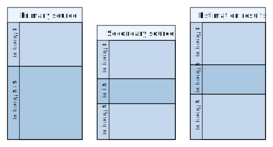

<!-- # rmarkdown::render(file.path(dbpath, "GitHub", "stan", "vignettes", "stani3_estimate.Rmd")) -->
## General

STAN combines time series from National Accounts by economic
activity. The estimation methodology consists of three major
components:

 - link series using growth rates
 - increase detail by appling shares from secondary sources to
  aggregates of the main data source
 - top-down adjustment to ensure consistency on all levels of the
   industry hierarchy

## Data Requirements

The data needs to meet the following requirements:

### Data for estimation
 - variables in columns: `cou`, `var`, `ind`, `year`, `value`, `sou`
   (order does not matter)

```{r, echo=FALSE, message=FALSE, warning=FALSE}
## load packages and data
require(stan)
require(stanData)
require(ggplot2)
data(STANNAi0)
data(STANNAi3)
data(STANNAi4)
data(stanDim)
```

```{r, echo=FALSE, message=FALSE, warning=FALSE}

## prepare data: extend
input.extend <- list(cou="AUT",
                     var="VALU",
                     ## ind="CTOTAL",
                     year=c(1995:2012))

df.extend1 <- subset(DATA.STANi3,
             cou%in%input.extend$cou &
             var%in%input.extend$var &
              ind%in%c("CTOTAL") &
              ## ind%in%c("CTOTAL, C15T37") &
              year%in%input.extend$year)
df.extend1[["sou"]] <- "STANandBTDi3"

df.extend2 <- subset(DATA.STANi4,
             cou%in%input.extend$cou &
             var%in%input.extend$var &
              ind%in%c("DTOTAL") &
              ## ind%in%c("DTOTAL", "D10T33") &
              year%in%input.extend$year)
df.extend2[["sou"]] <- "STANandBTDi4"
df.extend2$ind <- sub("DTOTAL", "CTOTAL", df.extend2$ind)
## df.extend2$ind <- sub("D10T33", "C15T37", df.extend2$ind)

df.extend2.USD <- convertCurrency(data=df.extend2, datacur=DATA.XRATES[DATA.XRATES$var=="EXCH",])

df.extend <- rbind(df.extend1, df.extend2.USD)

## prepare data: detail
input.detail <- list(cou="JPN",
                     var="VALU",
                     ind=c("C15T37", "C36", "C37"),
                     year=c(1995:2012))

## sort(setdiff(unique(df.detail2$ind), unique(df.detail1$ind)))

df.detail1 <- subset(DATA.STANi3,
                     cou%in%input.detail$cou &
                     var%in%input.detail$var &
                     ind%in%input.detail$ind &
                     year%in%input.detail$year)
df.detail1[["sou"]] <- "STANandBTDi3"

df.detail2 <- subset(DATA.INDSTAT32,
                     cou%in%input.detail$cou &
                     var%in%input.detail$var &
                     ind%in%input.detail$ind &
                     year%in%input.detail$year)
df.detail2[["sou"]] <- "INDSTAT32"
df.detail2$value <- df.detail2$value * 10^6

df.detail <- rbind(df.detail1, df.detail2)


```


## Extend

```{r, echo=FALSE, message=FALSE}

namesou <- c("STANandBTDi3", "STANandBTDi4")
result <- stan::extend(df.extend, namesou=namesou)
result$cou <- input.extend$cou
result$var <- input.extend$var
result$ind <- "CTOTAL"
result$sou <- "NAPATCH"
```

If the time coverage of our primary data source is insufficient and a secondary source covers for example more recent years, we attempt to extend the main source using the annual growth rate of the secondary source for years missing in the main source.

$$ estim_{t+1} = main_{t} * \frac{sec_{t+1}}{sec_{t}} $$

In the example below, the sources are as follows:

- Primary source: `r namesou[1]`
- Secondary source: `r namesou[2]`
- Estimated source: `r result$sou[1]`

```{r extend, eval=TRUE, fig.width=7, fig.height=5, echo=FALSE, message=FALSE}
## create figure: extend

result <- subset(result, select = c("cou", "var", "ind", "year", "value", "sou"))

df.extend.plot <- rbind(df.extend, result)

df.extend.plot$sou <- factor(df.extend.plot$sou, levels = c("STANandBTDi3", "STANandBTDi4", "NAPATCH"))

ggplot(data=df.extend.plot, aes(x=year, y=value)) + # , color=factor(sou)
  geom_line(aes(color = factor(sou))) +
    facet_grid(sou ~ .) +
#    guides(color = guide_legend(label.position = "top"))
    theme(legend.position = "top")

```

The dataset structure for this example looks as follows:

```{r, echo=FALSE, results="asis"}
knitr::kable(head(df.extend), row.names=FALSE)
```

## Apply distribution from secondary sources

```{r, echo=FALSE, message=FALSE}
namesou <- c("STANandBTDi3", "INDSTAT32")
result <- stan::detail(df.detail, namesou=namesou, ind.parent = input.detail$ind[1], ind.peers = input.detail$ind[-1])

result$cou <- input.detail$cou
result$var <- input.detail$var
## result$ind <- "CTOTAL"
result$sou <- "NAPATCH"
```

In case our data primary source is not sufficiently detailed and additional detail is available in a secondary source, we attempt to apply the distribution from the secondary source to the primary source.



In the example below, the sources are as follows:

- Primary source: `r namesou[1]`
- Secondary source: `r namesou[2]`
- Estimation results: `r result$sou[1]`

```{r detail, eval=TRUE, fig.width=7, fig.height=5, echo=FALSE, message=FALSE}
## create figure: detail

result <- subset(result, select = c("cou", "var", "ind", "year", "value", "sou"))

df.detail.plot <- rbind(df.detail, result)
df.detail.plot <- subset(df.detail.plot, ind%in%input.detail$ind)

df.detail.plot$sou <- factor(df.detail.plot$sou, levels = c("STANandBTDi3", "INDSTAT32", "NAPATCH"))

ggplot(data=df.detail.plot, aes(x=year, y=value)) + # , color=factor(sou)
  geom_line(aes(color = factor(sou))) +
  ## facet_grid(sou ~ ind, scales = "free")
  facet_grid(ind ~ sou, scales = "free") +
  theme(legend.position = "top")
```

In this example we observe two oddities:

- the primary sources stops in `r max(df.detail$year[df.detail$sou==namesou[1]])`, therefore the estimated results don't extend beyond
- the secondary source contains zeros in `r min(df.detail$year[df.detail$sou==namesou[2] & df.detail$value==0])`-`r max(df.detail$year[df.detail$sou==namesou[2] & df.detail$value==0])` and this is transferred to the estimated results

The dataset structure for this example looks as follows:

```{r, echo=FALSE, results="asis"}
knitr::kable(head(df.detail), row.names=FALSE)
```

The industries correspond to:

```{r, echo=FALSE, results="asis"}
knitr::kable(STANi3.INDLABEL[STANi3.INDLABEL$ind%in%input.detail$ind,], row.names=FALSE)
```

## Adjust

Numbers are adjusted top-down to ensure consitency with the total economy time series according to the hierarchy below:

```{r eval=FALSE, echo=FALSE}

## create indentet industry list below

indindent <- function(ind, list, char="    ", width=50) {
  nparent <- length(list[[ind]])
  if (nparent > 0)
    paste0(gsub(", ", "", toString(rep(char, nparent))), "- ", ind, "  ", toString(STANi3.INDLABEL$label[STANi3.INDLABEL$ind==ind], width=width-nparent*nchar(char)-4), "\n")
  else return("\n")
}

# indlist <- STANi4.INDALL[STANi4.INDALL%in%c(STANi4.INDA10, STANi4.INDA21, STANi4.INDA38, STANi4.INDA64, STANi4.INDA88)]

text <- unname(sapply(STANi3.INDA60All, indindent, list=STANi3.HIERARCHYINV))

cat(text)

```

- CTOTAL  Total
    - C01T05  Agriculture, hunting, forestry and fishing
        - C01T02  Agriculture, hunting and forestry
            - C01  Agriculture, hunting and related service....
            - C02  Forestry, logging and related service ac....
        - C05  Fishing, fish hatcheries, fish farms and rel....
    - C10T41  Industry including energy
        - C10T14  Mining and quarrying
            - C10T12  Mining and quarrying of energy producing....
                - C10  Mining of coal and lignite, extracti....
                - C11  Extraction of crude petroleum and na....
                - C12  Mining of uranium and thorium ores
            - C13T14  Mining and quarrying except energy produ....
                - C13  Mining of metal ores
                - C14  Other mining and quarrying
        - C15T37  Manufacturing
            - C15T16  Food products, beverages and tobacco
                - C15  Food products and beverages
                - C16  Tobacco products
            - C17T19  Textiles, textile products, leather and ....
                - C17T18  Textiles and textile products
                    - C17  Textiles
                    - C18  Wearing apparel, dressing and dy....
                - C19  Leather, leather products and footwear
            - C20T22  Wood, paper, paper products, printing an....
                - C20  Wood and products of wood and cork
                - C21T22  Pulp, paper, paper products, printin....
                    - C21  Pulp, paper and paper products
                    - C22  Printing and publishing
            - C23T26  Chemicals and non-metallic mineral products
                - C23  Coke, refined petroleum products and....
                - C24  Chemicals and chemical products
                - C25  Rubber and plastics products
                - C26  Other non-metallic mineral products
            - C27T28  Basic metals and fabricated metal products
                - C27  Basic metals
                - C28  Fabricated metal products, except ma....
            - C29  Machinery and equipment, n.e.c.
            - C30T33  Electrical and optical equipment
                - C30T33X  Computer, electronic and optical equ....
                    - C30  Office, accounting and computing....
                - C31  Electrical machinery and apparatus, ....
                    - C32  Radio, television and communicat....
                    - C33  Medical, precision and optical i....
            - C34T35  Transport equipment
                - C34  Motor vehicles, trailers and semi-tr....
                - C35  Other transport equipment
            - C36T37  Manufacturing n.e.c. and recycling
                - C36  Manufacturing n.e.c.
                - C37  Recycling
        - C40T41  Electricity gas and, water supply
            - C40  Electricity, gas, steam and hot water supply
            - C41  Collection, purification and distributio....
    - C45  Construction
    - C50T64  Wholesale and retail trade - restaurants and hot....
        - C50T55  Wholesale and retail trade - restaurants and....
            - C50T52  Wholesale and retail trade - repairs
                - C50  Sale, maintenance and repair of moto....
                - C51  Wholesale, trade and commission excl....
                - C52  Retail trade excl. motor vehicles - ....
            - C55  Hotels and restaurants
        - C60T64  Transport, storage and communications
            - C60T63  Transport and storage
                - C60  Land transport - transport via pipelines
                - C61  Water transport
                - C62  Air transport
                - C63  Supporting and auxiliary transport a....
            - C64  Post and telecommunications
    - C65T99  Finance, insurance, real estate and business ser....
        - C65T74  Finance, insurance, real estate and business....
            - C65T67  Financial intermediation
                - C65  Financial intermediation, except ins....
                - C66  Insurance and pension funding, excep....
                - C67  Activities auxiliary to financial in....
            - C70T74  Real estate, renting and business activities
                - C70  Real estate activities
                - C71T74  Renting of mach. and equip. - other ....
                    - C71  Renting of machinery and equipment
                    - C72  Computer and related activities
                    - C73T74  Research and development and oth....
                        - C73  Research and development
                        - C74  Other business activities
        - C75T99  Community, social and personal services
            - C75  Public admin. and defence - compulsory s....
            - C80T93  Education, Health and social work, other....
                - C80  Education
                - C85  Health and social work
                - C90T93  Other community, social and personal....
                    - C90  Sewage and refuse disposal, sani....
                    - C91  Activities of membership organiz....
                    - C92  Recreational, cultural and sport....
                    - C93  Other service activities
            - C95  Private households with employed persons
            - C99  Extra-territorial organizations and bodies
